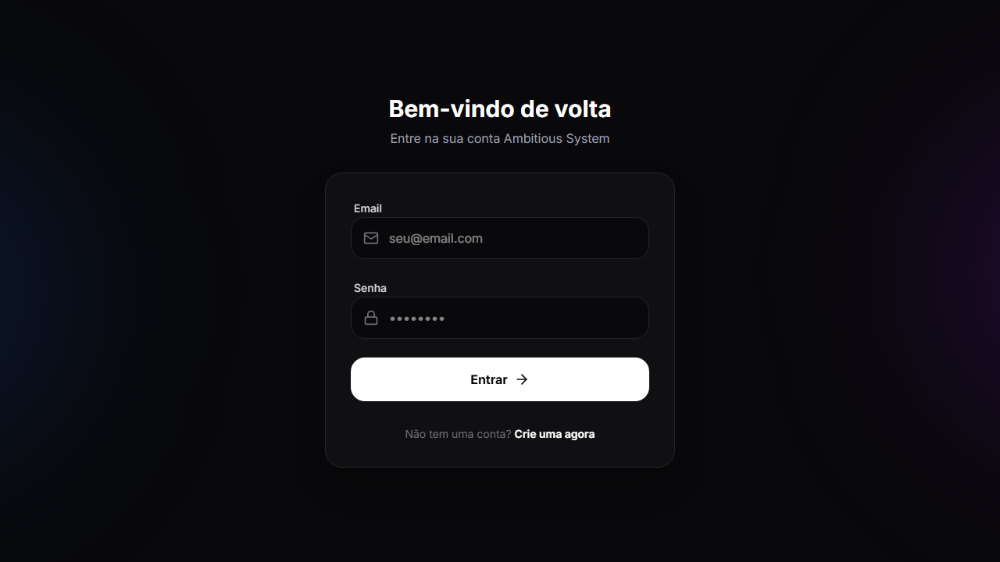
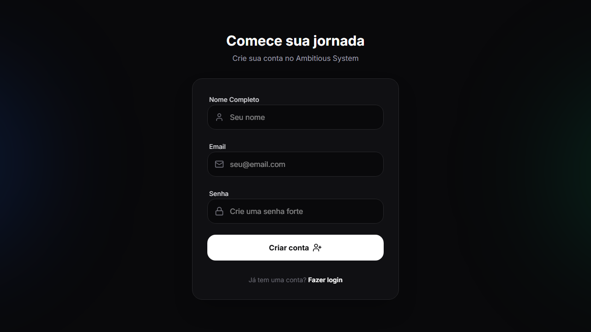
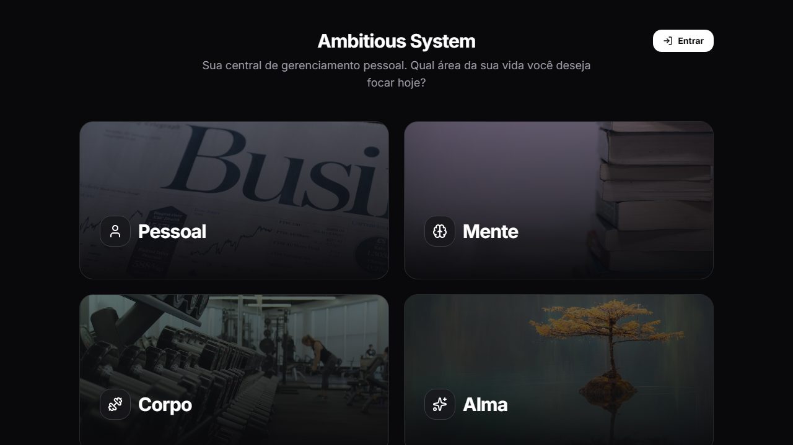
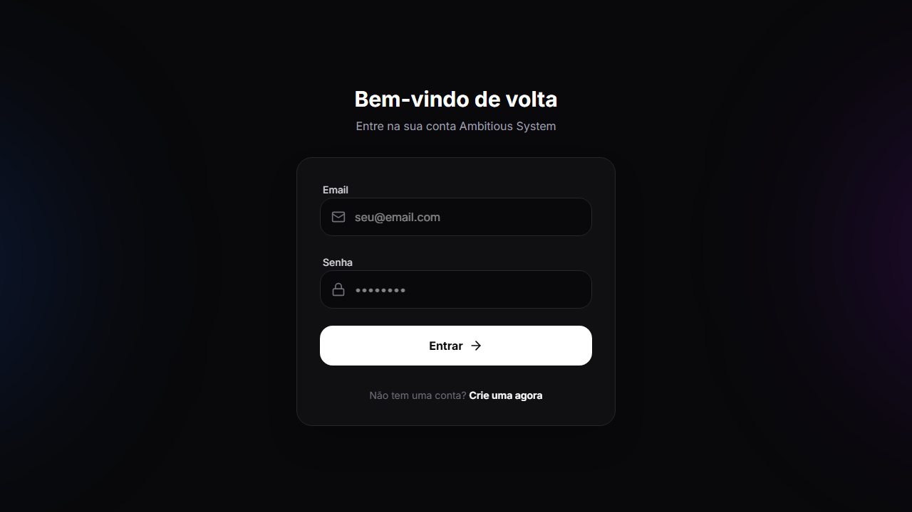

# Ambitious System

O **Ambitious System** é um gestor de rotina e estilo de vida alicerçado em 4 pilares fundamentais do desenvolvimento biopsicossocial do homem moderno: **Pessoal**, **Mente**, **Corpo** e **Alma**. 

Com um design arrojado e **tema Dark**, a aplicação recebe o usuário com uma tela inicial focada e minimalista: 4 quadrantes principais (cada um com uma imagem representativa e intuitiva), que dão acesso direto e rápido a cada um dos grandes pilares do sistema.

## Os 4 Pilares

O sistema é dividido nas seguintes grandes áreas temáticas:

### 1. Pessoal
Foco em organização financeira e planejamento da vida e tempo cotidiano.

- **Finanças:**
  - **Conta Básica:** Área geral de contas bancárias onde o usuário pode cadastrar lucros e despesas manualmente.
  - **Separação Estrita:** O sistema de carteiras/contas é isolado. Gastos de uma conta (Ex: Banco 1) não interferem no saldo ou gastos de outra (Ex: Banco 2).
  - **Categorização:** Transações podem e devem ser separadas em: *Moradia, Assinatura, Gasto Pessoal, Comida, Saúde, Trabalho, Educação, Utilidades, Fitness e Viagem.*
  - **Sistema de Cartão:** Controle de limite total, limite de uso atual e visualização da fatura. *(Nota: Este módulo é 100% gerenciado pelo cliente, dependendo de inserção manual, sem integrações com Open Banking).*

- **Diário (Anotações e Tasks):**
  - Espaço de notas tipo "journal" para refletir e escrever sobre o dia.
  - Adição de tarefas (tasks) diárias que possuem os seguintes atributos: *Título, Categoria, Rating (avaliação em formato de estrelas) e Data.*
  - As referidas tasks podem ser facilmente filtradas pelas categorias: *Saúde, Estudos, Pessoal, Família, Hobbies, Trabalho, Tarefas e Moradia.*

- **Quadro (Board):**
  - Gerenciamento visual de metas, objetivos e tarefas pendentes no estilo Kanban, proporcionando um tracking nítido de conclusão.

### 2. Mente
Foco em desenvolvimento intelectual, aprendizagem contínua e foco literário.

- **Estudos:**
  - **Quadro/Cronograma:** Layout visual completo de cronograma e planejamento semanal de estudos.
  - **Cadernos:** Área de conteúdo direcionado ao "que" precisa ser estudado. Serve como um To-Do focado ou uma ementa pessoal de progresso nas aulas e tópicos.
  - **Aulas:** Nome das aulas e registro programático vinculados aos cadernos de estudo.
  - **Revisões (Fluxo de Repetição):** O fluxo interno para garantir fixação segue a estrutura lógica: `Caderno` -> `Atividade Completa?` -> `(Sim) -> Encaminhado automaticamente para uma Seção de Revisão Espaçada` ou `(Não) -> Marca-se como Concluído ou Suspenso`.

- **Biblioteca:**
  - Repositório virtual onde o usuário arquiva livros do seu interesse atual, futuro ou passado.
  - Gestão e CRUD: Listar, adicionar, editar e excluir informações de cada livro.
  - Filtragem avançada de status e estante literária: *Lendo, Lista de Desejo, Próximas Leituras, Finalizados.*

### 3. Corpo
Foco em melhoria da saúde física global, performance, métricas corporais e alimentação balanceada.

- **Performance e Monitoramento:**
  - Metas físicas (bulking, cutting, recomposição, força) baseadas nos dados do usuário.
  - Registro do status físico e antropométrico atualizado, incluindo fotos e avaliação por bioimpedância/medidas.
  - Calculadora de calorias embutida (cálculo de TDEE, taxa metabólica basal e distribuição diária de macros).

- **Treinos:**
  - Acompanhamento das rotinas em ginásios ou esporte e progressão lógica de carga/intensidade.

- **Dieta e Macronutrientes:**
  - Registro modular e planejamento de *Refeições* diárias.
  - Um catálogo para salvar *Receitas* preferidas.
  - Cadastro minucioso da *Tabela Nutricional (macros, kcals)* para cada alimento cru ou preparado consumido.
  - Flexibilidade dinâmica para alocar, arrastar ou remover cada alimento existente num database interno dentro da estrutura da alimentação de um determinado dia ou refeição.

### 4. Alma
Foco no relaxamento consciente, descompressão, desestresse e engajamento criativo.

- **Hobbies:**
  - Gestão, rastreamento e rotina das atividades de descompressão, passatempos e paixões pessoais focadas puramente no lazer do utilizador.
- **Brainstorm:**
  - Um espaço "vazio" proposital ou lousa virtual livre para elaboração de ideias soltas, fluxos de pensamento, dumpings mentais e insights aleatórios para descarregar o cérebro.

---

## Imagens

### Autenticação

| Página | Descrição |
|--------|-----------|
|  | Página de Login |
|  | Página de Registro |

### Dashboard

| Página | Descrição |
|--------|-----------|
|  | Dashboard principal com os 4 pilares |

### Pilar Pessoal

| Página | Descrição |
|--------|-----------|
|  | Gestión de contas e transações |
|  | Anotações e tarefas diárias |
|  | Quadro Kanban de metas |

### Pilar Mente

| Página | Descrição |
|--------|-----------|
|  | Cadernos e aulas de estudo |
|  | Biblioteca de livros |

### Pilar Corpo

| Página | Descrição |
|--------|-----------|
|  | Avaliações físicas e TDEE |
|  | Rotinas de treino |
|  | Planejamento de refeições |

### Pilar Alma

| Página | Descrição |
|--------|-----------|
|  | Gestão de hobbies |
|  | Quadro de ideias |

---

> ⚠️ **Documentação Técnica Adicional:**
> Para informações a respeito dos princípios técnicos, regras de testes, otimização de performance, padrões focados em 'Mobile-First' e UX para futuras atualizações da base de código do The Ambitious System, por favor visite nosso guia interno: [`docs/guide.md`](./docs/guide.md).
